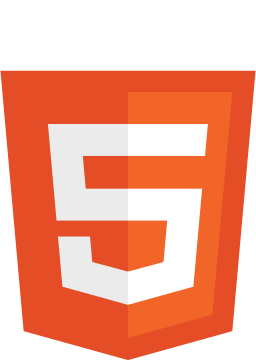

# Hello there i'm Raul Contreras 👋

## **<code style="color:lightgreen;">About me</code>**

<code>
Hi! i'm a guy that likes to achieve personal challeges and improve skills ^^
</code>

### **<code style="color:lightgreen;">My contacts</code>**

[ <code style="color:coral;">Linkedin</code>](https://www.linkedin.com/in/raul-contreras-abb07a25a/)

## **<code style="color:lightgreen;">Skills</code>**

[ <code style="color:coral;">HTML</code>](https://html.spec.whatwg.org/multipage/)

[<code style="color:coral;">CSS</code>](https://www.w3.org/TR/CSS/)

### **<code style="color:lightgreen;">Frameworks</code>**

[<code style="color:coral;">Tailwindcss</code>](https://tailwindcss.com/)

## **<code style="color:lightgreen;">Works releases</code>**

[<code style="color:coral;">Responsive</code>](https://github.com/RaseGW/Resposive)

## **<code style="color:lightgreen;">Team releases</code>**

[<code style="color:coral;">Planets data table</code>]()
# RaseGW
